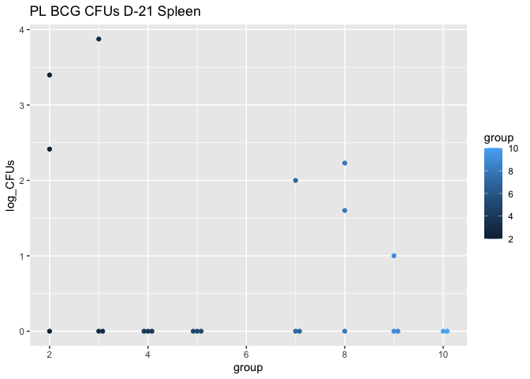

<!-- README.md is generated from README.Rmd. Please edit that file -->

# bactcountr

<!-- badges: start -->

<!-- badges: end -->

The goal of bactcountr is to provide an automated way to calculate CFUs
based on the dilutions used and to plot the final results.

## Installation

You can install the development version from
[GitHub](https://github.com/) with:

``` r
# install.packages("devtools")
devtools::install_github("aef1004/bactcountr")
```

## Example

This is a basic example which shows you how to solve a common problem:

``` r
library(bactcountr)

library(dplyr)
library(tidyr)
library(ggplot2)
library(ggbeeswarm)
## basic example code
```

``` r
CFU_raw_formatted <- tidy_CFU(CFU_excel_raw, "CFUs")
#> Warning: NAs introduced by coercion

CFU_one_dilution <- pick_one_dilution(CFU_raw_formatted, "CFUs", c("group", "organ", "mouse"))

calculate_cfu(CFU_one_dilution, 5, 0.5, .5, "dilution", "CFUs")
#> # A tibble: 46 x 8
#> # Groups:   group, organ, mouse [46]
#>    group mouse organ  dilution  CFUs calculated_CFU whole_CFUs log_CFUs
#>    <dbl> <chr> <chr>     <dbl> <dbl>          <dbl>      <dbl>    <dbl>
#>  1     2 A     Lung          0     0              0          0     0   
#>  2     2 B     Lung          0     0              0          0     0   
#>  3     2 C     Lung          0     2             10         20     1.30
#>  4     2 A     Spleen        0    26            130        260     2.41
#>  5     2 B     Spleen        2    10           1250       2500     3.40
#>  6     2 C     Spleen        0     0              0          0     0   
#>  7     3 A     Lung          0     0              0          0     0   
#>  8     3 B     Lung          0     1              5         10     1   
#>  9     3 C     Lung          0     0              0          0     0   
#> 10     3 A     Spleen        0     0              0          0     0   
#> # … with 36 more rows
```

``` r

analyzed_CFUs <- tidy_CFU(CFU_excel_raw, "CFUs") %>%
  pick_one_dilution("CFUs", c("group", "organ", "mouse")) %>%
  filter(organ == "Spleen") %>%
  calculate_cfu(5, 0.5, .5, "dilution", "CFUs")


ggplot(analyzed_CFUs, aes(group, log_CFUs, color = group)) +
  geom_beeswarm(groupOnX = TRUE) +
  ggtitle("PL BCG CFUs D-21 Spleen")
```


