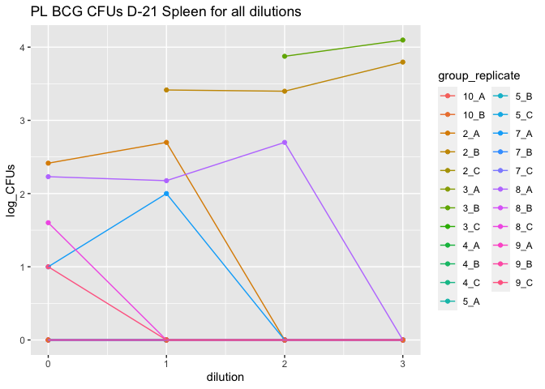
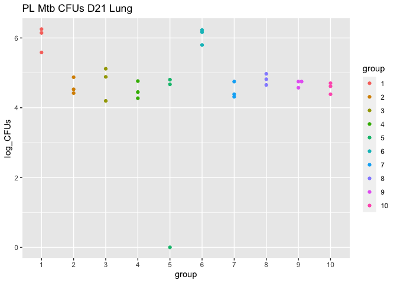

<!-- README.md is generated from README.Rmd. Please edit that file -->

# bactcountr

<!-- badges: start -->

<!-- badges: end -->

The goal of bactcountr is to provide an automated way to calculate CFUs
based on the dilutions used and to plot the final results.

## Installation

You can install the development version from
[GitHub](https://github.com/) with:

``` r
# install.packages("devtools")
devtools::install_github("aef1004/bactcountr")
```

## Example

This is a basic example which shows you how to solve a common problem:

``` r
library(bactcountr)

library(dplyr)
library(tidyr)
library(ggplot2)
library(ggbeeswarm)
library(readxl)
library(purrr)
library(rstatix)
library(ggpubr)
```

In order to use the first function `tidy_CFU` the data must have some
columns:

  - some type of naming or grouping convention to separate out the
    individual observations such as the columns group, mouse, organ
  - dilution columns that are labeled `dilution_x` where x is the
    dilution used

<!-- end list -->

``` r
data("CFU_data")
head(CFU_data)
#> # A tibble: 6 x 7
#>   group mouse organ  dilution_0 dilution_1 dilution_2 dilution_3
#>   <dbl> <chr> <chr>  <chr>      <chr>           <dbl>      <dbl>
#> 1     2 A     Spleen 26         10                  0          0
#> 2     2 B     Spleen TNTC       52                 10          5
#> 3     2 C     Spleen 0          0                   0          0
#> 4     3 A     Spleen 0          0                   0          0
#> 5     3 B     Spleen TNTC       TNTC               30         10
#> 6     3 C     Spleen 0          0                   0          0
```

When the `tidy_CFU` function is used, it puts it into a tidy format. The
naming/grouping columns are left alone, but the dilution and CFU columns
are gathered so that each row of the dataframe represents a single
observation. Any values in the original dataframe that are labeled as
“TNTC” (Too Numerous To Count) are converted to NA columns as they
cannot be used to calculate the CFUs.

``` r
CFU_raw_formatted <- tidy_CFU(CFU_data)
#> Warning: Problem with `mutate()` input `CFUs`.
#> ℹ NAs introduced by coercion
#> ℹ Input `CFUs` is `as.numeric(CFUs)`.
#> Warning in mask$eval_all_mutate(dots[[i]]): NAs introduced by coercion

head(CFU_raw_formatted)
#> # A tibble: 6 x 5
#>   group mouse organ  dilution  CFUs
#>   <dbl> <chr> <chr>     <dbl> <dbl>
#> 1     2 A     Spleen        0    26
#> 2     2 C     Spleen        0     0
#> 3     3 A     Spleen        0     0
#> 4     3 C     Spleen        0     0
#> 5     4 A     Spleen        0     0
#> 6     4 B     Spleen        0     0
```

The function `pick_one_dilution` sifts through all of the data for the
groups and finds the CFU observation for each group/mouse/organ that is
closest to 25 CFUs (and therefore, most likely the most accurate
observation). It picks one of the dilution-CFU observations per
grouping.

``` r
CFU_one_dilution <- pick_one_dilution(CFU_raw_formatted, "CFUs", c("group", "organ", "mouse"))

head(CFU_one_dilution)
#> # A tibble: 6 x 5
#> # Groups:   group, organ, mouse [6]
#>   group mouse organ  dilution  CFUs
#>   <dbl> <chr> <chr>     <dbl> <dbl>
#> 1     2 A     Lung          0     0
#> 2     2 B     Lung          0     0
#> 3     2 C     Lung          0     2
#> 4     2 A     Spleen        0    26
#> 5     2 B     Spleen        2    10
#> 6     2 C     Spleen        0     0
```

The `calculate_cfu` function calculates the whole CFUs and log CFUs for
each observation in the data. It takes in experimental parameters such
as the dilution factor used, the volume (in milliliters) used to
resuspend the CFU solution, and the percent of the organ used (if organ
is used, default is 1 so whole organ).

``` r
final_data <- calculate_cfu(CFU_one_dilution, 
                            dilution_factor = 5, 
                            resuspend_volume_ml = 0.5, 
                            percent = 0.5, "dilution", "CFUs")

head(final_data)
#> # A tibble: 6 x 8
#> # Groups:   group, organ, mouse [6]
#>   group mouse organ  dilution  CFUs calculated_CFU whole_CFUs log_CFUs
#>   <dbl> <chr> <chr>     <dbl> <dbl>          <dbl>      <dbl>    <dbl>
#> 1     2 A     Lung          0     0              0          0     0   
#> 2     2 B     Lung          0     0              0          0     0   
#> 3     2 C     Lung          0     2             10         20     1.30
#> 4     2 A     Spleen        0    26            130        260     2.41
#> 5     2 B     Spleen        2    10           1250       2500     3.40
#> 6     2 C     Spleen        0     0              0          0     0
```

## Example of full run-through of the data and plotting

This is an example reading in the data from an excel file. The functions
are all run through so that the log CFUs are calculated for each group
and mouse for the spleen. The results can subsequently be plotted.

``` r
# example file for the excel file
example_file_address <- system.file("extdata", "PL_D-21_BCG_CFUs.xlsx", package = "bactcountr")

# all of the functions are used to tidy the data, pick one dilution, and then calculate the log CFUs
analyzed_CFUs <- read_xlsx(example_file_address) %>%
  tidy_CFU() %>%
  pick_one_dilution("CFUs", c("group", "organ", "mouse")) %>%
  filter(organ == "Spleen") %>%
  calculate_cfu(dilution_factor = 5,
                resuspend_volume_ml = 0.5,
                percent = .5, "dilution", "CFUs")

# the CFUs can then be plotted
ggplot(analyzed_CFUs, aes(group, log_CFUs, color = group)) +
  geom_beeswarm(groupOnX = TRUE) +
  ggtitle("PL BCG CFUs D-21 Spleen")
```


The average of the groups can then be plotted.

``` r
# calculate the average CFUs per group
avg_data <- analyzed_CFUs %>%
  ungroup() %>%
  select(group, log_CFUs) %>%
  group_by(group) %>%
  mutate(avg_CFUs = mean(log_CFUs)) %>%
  select(group, avg_CFUs) %>%
  unique() %>%
  rename(log_CFUs = avg_CFUs) %>%
  ungroup() %>%
  mutate(group = as.factor(group))

# plot average and individual CFUs
ggplot(analyzed_CFUs, aes(x = as.factor(group), y = log_CFUs)) +
  geom_bar(data = avg_data,  stat = "identity", aes(fill =group)) +
    geom_point(color = "black") +
  xlab("Group") +
  ggtitle("PL BCG D-21 Spleen Average CFUS")
```


## Alternative use without using pick\_one\_dilution

If you want to see the consistancy of the plating across the dilutions,
you can skip the `pick_one_dilution` function and plot the calculated
log\_CFUs for group/mouse against the dilutions.

``` r
analyzed_CFUs_wo_pick_one <- read_xlsx(example_file_address) %>%
  tidy_CFU() %>%
  filter(organ == "Spleen") %>%
  calculate_cfu(5, 0.5, .5, "dilution", "CFUs") %>%
  unite(col = group_mouse, group, mouse, sep = "_")
#> Warning: Problem with `mutate()` input `CFUs`.
#> ℹ NAs introduced by coercion
#> ℹ Input `CFUs` is `as.numeric(CFUs)`.
#> Warning in mask$eval_all_mutate(dots[[i]]): NAs introduced by coercion

ggplot(analyzed_CFUs_wo_pick_one, aes(dilution, log_CFUs, color = group_mouse)) +
  geom_point() +
  geom_path() +
  ggtitle("PL BCG CFUs D-21 Spleen for all dilutions")
```



## Calculate statistical significance with different dataset

We will use a different dataset here that has real statistical
significance. The data is from the PL Experiment, D21 post-infection
with *Mycobacterium tuberculosis*.

``` r
# example file for the excel file
example_file_address <- system.file("extdata", "PL_D21_Mtb_CFUs.xlsx", package = "bactcountr")

# all of the functions are used to tidy the data, pick one dilution, and then calculate the log CFUs
analyzed_CFUs <- read_xlsx(example_file_address, sheet = "Raw Counts") %>%
  tidy_CFU() %>%
  pick_one_dilution("CFUs", c("group", "organ", "mouse")) %>%
  filter(organ == "Lung") %>%
  calculate_cfu(dilution_factor = 5, 
                resuspend_volume = 0.5,
                percent = 1/3, "dilution", "CFUs")

# the CFUs can then be plotted
ggplot(analyzed_CFUs, aes(group, log_CFUs, color = group)) +
  geom_beeswarm(groupOnX = TRUE) +
  ggtitle("PL Mtb CFUs D21 Lung")
```



Calculate statistical significance with ANOVA and Tukey HSD

``` r
sig <- analyzed_CFUs %>%
  ungroup() %>%
  select(group, log_CFUs) %>%
    mutate(group = as.factor(group)) %>%
  rstatix::tukey_hsd(log_CFUs ~ group) %>%
  rstatix::add_xy_position(x = "group")

ggline(x = "group", y = "log_CFUs", color = "group", alpha = 0.5, data = analyzed_CFUs,
       font.label = list(size = 30, face = "plain")) +
  stat_pvalue_manual(data = sig, hide.ns = TRUE) +
  ggtitle("PL Mtb CFUs D21 Lung")
```


